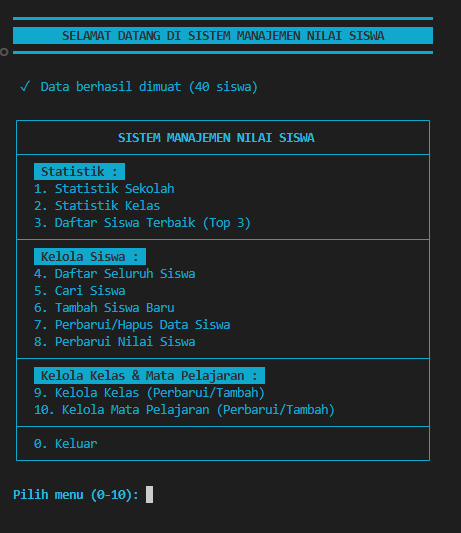
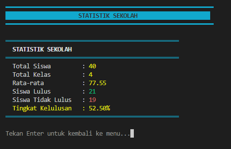
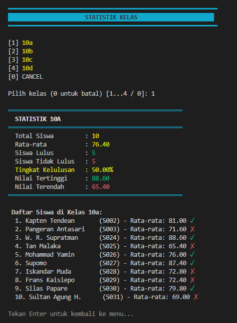
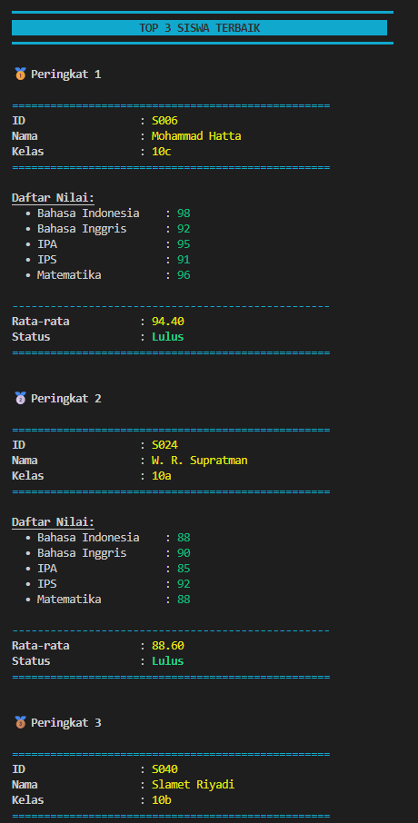
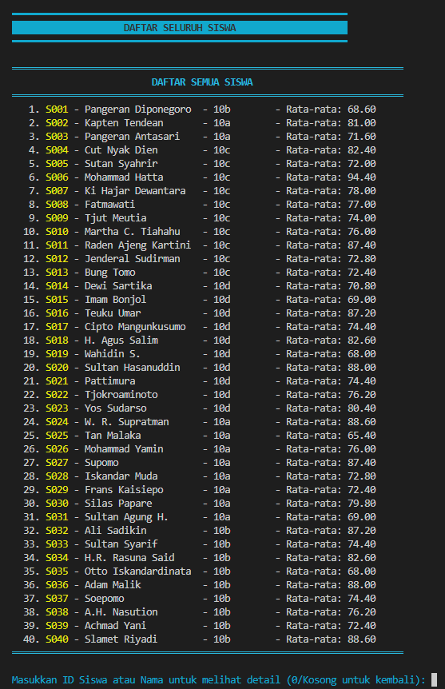
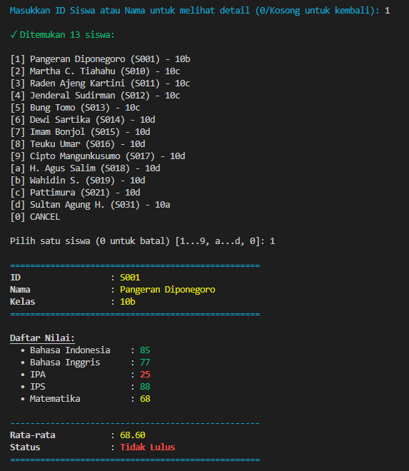

# Challenge 4: Student Grade Management System

[](https://classroom.github.com/a/mN9h8nSd)

---

An efficient Command Line Interface (CLI) data management system for managing student academic data, including grade recording, data updates, and statistical analysis of passing rates.

## Key Features

This system provides comprehensive functionality for school data administrators:

- **Persistent Data Loading & Storage**: Uses `students.json` as a single source of truth. Every data change (CRUD) is saved in real-time to this file.

- **Student Management (CRUD)**: Add, search, update, and delete student data (ID, Name, Class).

- **Grade Management**: Enter and update subject grades (0-100) for each student.

- **Statistical Analysis**:
  - Comprehensive School Statistics (Global average, passing rate)
  - Per-Class Statistics (Class average, highest/lowest grades in class)
  - Top Student Rankings (Top N students based on average and passing status)

- **Metadata Management**: Centrally manage lists of Class Names and Subject Names.

- **Data Validation**: Ensures data integrity (ID format, grade range 0-100) before saving.

## Technical Requirements

This application runs in a Node.js environment.

| Requirement | Details                                    |
| ----------- | ------------------------------------------ |
| Node.js     | Version 18.x or higher                     |
| Environment | Terminal/Command Prompt (CLI)              |
| Dependencies| `readline-sync`, `colors`, `fs` (built-in) |

## Project Architecture

This project follows modularity principles by separating logic into several files:

```
.
├── index.js               # Main application file (Main Function, DataService, UIHandler)
├── students.json          # Data file (including initial data)
└── src/
    ├── Student.js         # Class to represent a single student
    └── StudentManager.js  # Class to manage student collections
```

## Classes and Functions Overview

### **Student.js** - Student Entity Class

**Purpose**: Represents a single student with encapsulated grade data.

| Type | Name | Description |
|------|------|-------------|
| **Private Field** | `#grades` | Stores subject grades (encapsulated) |
| **Constructor** | `constructor(id, name, studentClass)` | Initializes student with ID, name, and class |
| **Method** | `addGrade(subject, score)` | Adds/updates grade (validates 0-100), returns boolean |
| **Method** | `getGrade(subject)` | Returns grade for specific subject |
| **Method** | `getAllGrades()` | Returns all grades as object |
| **Method** | `getAverage()` | Calculates average grade |
| **Method** | `getGradeStatus()` | Returns passing status (Pass ≥75, Fail <75) |
| **Method** | `displayInfo()` | Displays student info with colored formatting |
| **Method** | `toJSON()` | Converts student to JSON format |
| **Static Method** | `fromJSON(json)` | Creates Student instance from JSON |
| **Getter** | `id` | Returns student ID (read-only) |
| **Getter/Setter** | `name` | Gets/sets student name |
| **Getter/Setter** | `class` | Gets/sets student class |

---

### **StudentManager.js** - Student Collection Manager

**Purpose**: Manages the collection of students and provides CRUD operations.

| Type | Name | Description |
|------|------|-------------|
| **Private Field** | `#students` | Array storing all students (encapsulated) |
| **Private Field** | `#classNames` | Array of registered class names |
| **Private Field** | `#subjectNames` | Array of registered subject names |
| **Constructor** | `constructor()` | Initializes empty collections |
| **Method** | `addStudent(student)` | Adds student (validates unique ID, non-empty name) |
| **Method** | `findStudent(id)` | Finds student by ID |
| **Method** | `findStudentsByIdOrName(query)` | Searches students by ID or name (partial match) |
| **Method** | `getAllStudents()` | Returns all students array |
| **Method** | `updateStudent(id, data)` | Updates name/class only (ID immutable) |
| **Method** | `removeStudent(id)` | Removes student by ID |
| **Method** | `getTopStudents(n=3)` | Returns top N students sorted by average |
| **Method** | `getStudentsByClass(className)` | Filters students by class name |
| **Method** | `getClassStatistics(className)` | Calculates statistics for a specific class |
| **Method** | `getSchoolStatistics()` | Calculates overall school statistics |
| **Method** | `getAllClassNames()` | Returns list of class names |
| **Method** | `getAllSubjectNames()` | Returns list of subject names |
| **Method** | `addClassName(name)` | Adds new class name |
| **Method** | `addSubjectName(name)` | Adds new subject name |
| **Method** | `updateClassName(oldName, newName)` | Updates class name across all students |
| **Method** | `updateSubjectName(oldName, newName)` | Updates subject name across all grades |
| **Method** | `toJSON()` | Exports all data to JSON format |
| **Method** | `fromJSON(data)` | Imports students from JSON array |
| **Method** | `setAllClassNames(names)` | Sets all class names at once |
| **Method** | `setAllSubjectNames(names)` | Sets all subject names at once |
| **Method** | `getStudentCount()` | Returns total number of students |
| **Method** | `generateNextStudentId()` | Generates next available student ID (S001, S002, etc.) |

---

### **index.js** - Main Application & Utilities

**Purpose**: Entry point with UI handlers, data service, validators, and menu functions.

#### **DataService Class**
| Type | Name | Description |
|------|------|-------------|
| **Property** | `DATA_FILE` | Path to students.json |
| **Property** | `manager` | StudentManager instance |
| **Method** | `loadData()` | Loads data from JSON file with error handling |
| **Method** | `saveData()` | Saves data to JSON file with error handling |

#### **Validator Class** (Static Methods)
| Method | Description |
|--------|-------------|
| `isValidStudentId(id)` | Validates ID format (S001-S999) |
| `isValidName(name)` | Validates non-empty string |
| `isValidGrade(score)` | Validates grade range (0-100) |

#### **UIHandler Class** (Static Methods)
| Method | Description |
|--------|-------------|
| `displayTitle(title)` | Shows colored title with borders |
| `displayMenu()` | Shows main menu with 10 options |
| `displayStudentInfo(student)` | Shows detailed student information |
| `displayAllStudentsSummary(students)` | Displays students in table format |
| `displayFoundStudents(students, criteria)` | Shows search results in table |
| `showLoadingAnimation(message)` | Shows animated loading spinner |

#### **Main Menu Functions**
| Function | Menu Option | Description |
|----------|-------------|-------------|
| `viewSchoolStatistics()` | 1 | Displays overall school statistics |
| `viewClassStatistics()` | 2 | Displays statistics for selected class |
| `viewTopStudents()` | 3 | Shows top 3 students |
| `viewAllStudents()` | 4 | Lists all students in table format |
| `searchStudent()` | 5 | Search by ID/name/class/status/grade |
| `addNewStudent()` | 6 | Add new student with validation |
| `manageStudentData()` | 7 | Update or delete student |
| `addGradeToStudent()` | 8 | Add/update student grades |
| `manageClassNames()` | 9 | Manage class name list |
| `manageSubjectNames()` | 10 | Manage subject name list |
| `main()` | - | Main application loop |

#### **Helper Functions**
| Function | Description |
|----------|-------------|
| `selectStudentInteractive(title)` | Interactive student selection with search |
| `searchStudentByClass()` | Search students by class |
| `searchStudentByGradeStatus()` | Search by pass/fail status |
| `searchStudentBySubjectScore()` | Search by subject score with operators (>, <, =, >=, <=) |

---

## Installation & Execution Guide

### 1. Clone Project (If needed)

Skip this step if you already have all files in your local directory.

### 2. Install Node.js Dependencies

Navigate to the main project directory in terminal, then install required packages:

```bash
# Make sure you're in the same directory as package.json
npm install readline-sync colors
```

### 3. Run Application

Execute the application using Node.js:

```bash
node index.js
```

Or use the npm script:

```bash
npm start
```

### 4. Interaction

After running the application:

1. **Loading**: Wait for loading animation to complete. Data loading status from `students.json` will be displayed.
2. **Menu**: Choose numbers `1` to `10` to execute available functionalities.
3. **Input**: The application will prompt for input (such as ID, Name, or Grade) using interactive prompts.
4. **Exit**: Enter `0` (Exit) to stop the application and return to terminal.

---

## Screenshots








---

## Features Implementation

### OOP Implementation
- **Encapsulation**: Private fields (`#grades`, `#students`, `#classNames`, `#subjectNames`) with getter/setter
- **Class Structure**: Separate Student and StudentManager classes with clear responsibilities
- **Method Organization**: Logical grouping of related functionality

### Functionality 
- **CRUD Operations**: Full Create, Read, Update, Delete for students
- **Grade Management**: Add/update grades with validation (0-100 range)
- **Statistical Analysis**: School-wide and per-class statistics
- **Search & Filter**: Multiple search criteria (ID, name, class, status, grade)
- **Data Persistence**: Auto-save on every CRUD operation to students.json

### Code Quality 
- **Modular Design**: Separated concerns across multiple files (index.js, Student.js, StudentManager.js)
- **Error Handling**: Comprehensive try-catch with user-friendly messages
- **Input Validation**: All user inputs validated before processing
- **Documentation**: Clear JSDoc comments and inline documentation

### Bonus Features
- **Colored UI**: Enhanced terminal output with colors library and emojis
- **Loading Animation**: Professional loading experience
- **Advanced Search**: Multiple criteria with comparison operators (>, <, =, >=, <=)
- **Class Statistics**: Detailed per-class analytics with pass/fail breakdown
- **Metadata Management**: Centralized class and subject name management
- **Interactive Selection**: User-friendly menu navigation with readline-sync

---
